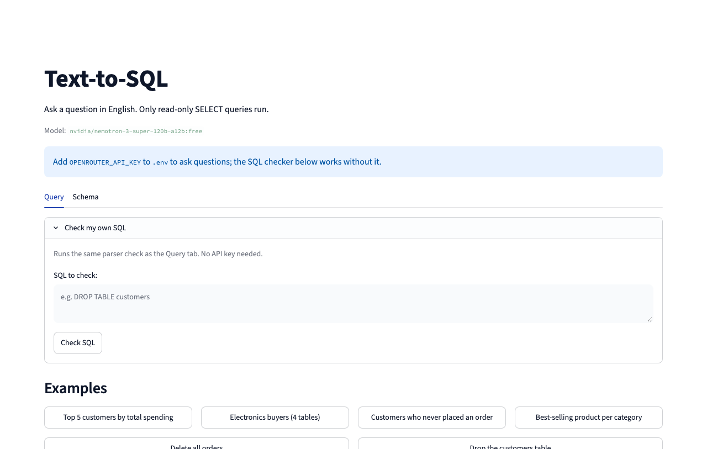

# Text-to-SQL

People who don't know SQL can't ask a database questions, and letting a language model write the SQL adds a risk: the query might change or delete data. Text-to-SQL turns an English question into a SQLite query over a small shop database and runs it only after a parser confirms it is a single read-only `SELECT` on known tables, on a database file opened read-only.



## Run (macOS)

Needs uv (`brew install uv`) and a free OpenRouter key from openrouter.ai/keys.

```bash
cp .env.example .env              # then add OPENROUTER_API_KEY
uv sync
uv run streamlit run app.py       # http://localhost:8501
```

Without a key the page still opens, and "Check my own SQL" works. `ecommerce.db` is built from `schema.sql` and `seed.sql` on the first run.

## How it works

1. `app.py` takes the question and calls `answer(question)` in `engine.py`.
2. The prompt holds the real `CREATE TABLE` text, the values of category columns, a fixed "today" of 2026-02-28 and a few examples. It never holds rows.
3. `ask_model` sends one request to OpenRouter and pulls the SQL out of the reply.
4. `check_sql` parses the SQL with sqlglot. If it is not a single `SELECT` on the four tables (or the query's own CTEs), the reason is shown and nothing runs.
5. If SQLite cannot compile an allowed query, the error goes back to the model once.
6. `run_query` opens the database read-only, stops the query at 3 seconds and returns up to 1,000 rows.

| SQL that comes back | What happens |
| --- | --- |
| `SELECT * FROM orders` | Runs |
| `SELECT 1; DROP TABLE orders;` | Rejected: more than one statement |
| `UPDATE products SET price = 0` | Rejected: not a `SELECT` |
| `WITH d AS (DELETE FROM orders RETURNING *) SELECT * FROM d` | Rejected: a write inside a CTE |
| `SELECT * FROM sqlite_master` | Rejected: unknown table |
| A recursive query that never ends | Allowed, then stopped at 3 seconds |

Accuracy: **?/20** on the 20-question eval (`uv run python -m scripts.eval`, which uses the API key), with `nvidia/nemotron-3-super-120b-a12b:free`.

## API

There is no HTTP API; Streamlit serves the page. The one outside call is OpenRouter's chat completions endpoint. These are the functions worth knowing:

| Function | File | What it does |
| --- | --- | --- |
| `answer` | `engine.py` | Runs the steps for one question |
| `schema_text` | `schema.py` | Builds the schema text for the prompt |
| `ask_model` | `llm.py` | Sends the request and returns the SQL from the reply |
| `check_sql` | `guardrails.py` | Returns `(allowed, reason)` without running anything |
| `run_query` | `executor.py` | Read-only run with the deadline and the row cap |

## Tests

```bash
uv run pytest -q
```

The parser check against a list of 15 queries, and the read-only connection, row cap and deadline. No network.
