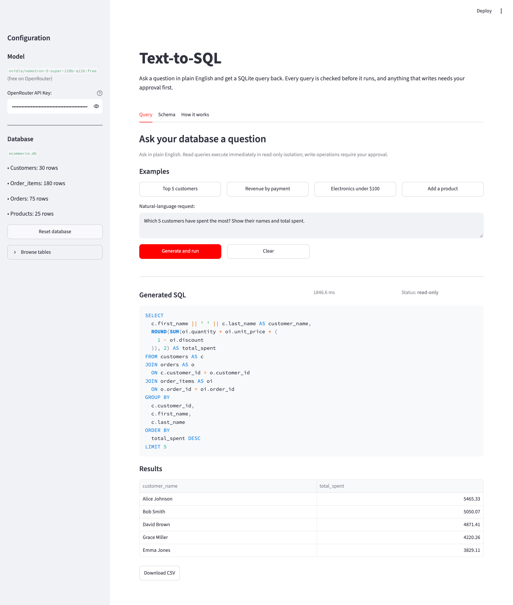

# Text-to-SQL

Ask a question in English, get SQLite over a known schema. The model writes the SQL; an AST
allowlist and SQLite's own authorizer decide whether it runs.



**Stack:** Python, Streamlit, sqlglot, SQLite, pandas, uv, OpenRouter.

## How it works

1. **The schema prompt is generated.** At startup the app reads the `CREATE TABLE` text for the
   four tables straight from `sqlite_master`. Column meanings are `-- comments` inside
   `schema.sql`, and SQLite keeps them in that text. Below it goes a short **data notes** block,
   also generated: the values of each TEXT column with 10 or fewer distinct values (categories,
   order statuses, payment methods, segments) and the first and last value of each date column.
   The model sees the schema and these notes, never rows.
2. **A fixed "today".** Orders stop in February 2026, so the prompt says today is
   `AS_OF_DATE` (2026-02-28) and forbids `date('now')`. Otherwise "orders in the last 30 days"
   would return nothing.
3. **One model** (`nvidia/nemotron-3-super-120b-a12b:free`) through OpenRouter. A free key is
   enough. If SQLite can't compile the reply, the error goes back to the model, so a question uses
   at most 3 calls. A refusal or a rejected destructive query is never retried.
4. If the request asks to change data, the model is told to reply exactly `-- REFUSE: read-only`.
   That counts only when it is the whole reply.

## How destructive queries are stopped (three layers)

The model is not trusted. Its SQL has to pass three independent layers.

1. **AST allowlist** (`guardrails.py`). sqlglot parses the SQL.
   - Exactly one statement, and its root must be `SELECT`, `UNION`, `INTERSECT` or `EXCEPT`.
   - The whole tree is walked: any `INSERT`/`UPDATE`/`DELETE` (also inside a CTE), DDL,
     `PRAGMA`, `ATTACH`, `VACUUM`, transaction commands or `SELECT … INTO` is rejected.
   - Only the four known tables and CTE names defined in that part of the query. No
     `sqlite_master`, no other database prefix, no table-valued functions such as `json_each`.
   - Only allowlisted functions, so `load_extension`, `readfile` and `randomblob` are out.
   - The table list comes from `schema.sql`, and the function list is shared with layer 2.
2. **SQLite authorizer and limits** (`executor.py`). SQLite checks every step itself:
   - the authorizer allows only `SELECT`, reads of the four tables and the same function
     allowlist, and denies everything else (writes, DDL, `PRAGMA`, `ATTACH`, SQLite's own
     tables, table-valued functions such as `json_each`);
   - `setlimit`: no attached databases, 1 MB per value, 20 KB of SQL;
   - a 3 s wall-clock deadline and a 1,000-row cap.
3. **A read-only file.** The connection is opened with `mode=ro` and `query_only`.

**Why not a regex?** Comments, casing and string literals beat a keyword list.
`SELECT ';DROP TABLE x'` is safe, while `SELECT 1; -- x` followed by `DROP …` on the next line is
not. Parsing sees the difference.

**Why not trust sqlglot alone?** Parsers disagree. sqlglot reads `REINDEX` as a column name and
`SAVEPOINT a` as an alias. The root allowlist catches those, and the authorizer works on SQLite's
own parse, so a parser mistake can't get a write through. sqlglot is pinned in `uv.lock`, and the
attack corpus runs in CI as the guard when it is upgraded.

| What comes back | What happens |
|---|---|
| `SELECT * FROM orders` | runs, on a read-only connection |
| `SELECT 1; DROP TABLE orders;` | rejected: multiple statements |
| `ATTACH DATABASE '/tmp/x' AS x` | rejected by the AST allowlist and the authorizer; no file is created |
| `VACUUM INTO '/tmp/x.db'` | rejected by the AST allowlist and the authorizer; no file is created |
| `PRAGMA query_only = OFF` | rejected: only SELECT queries run |
| `UPDATE products SET price = 0` | rejected: only SELECT queries run |
| `DROP TABLE customers` | rejected: only SELECT queries run |
| `WITH d AS (DELETE FROM orders RETURNING *) SELECT * FROM d` | rejected: DML inside a CTE |
| `WITH RECURSIVE r(x) AS (SELECT 1 UNION ALL SELECT x+1 FROM r) SELECT count(*) FROM r` | allowed, then stopped by the 3 s deadline |

`tests/attacks.yaml` holds **64 attack and edge cases** (46 must be rejected, 18 must pass).
`test_db_layer_blocks_without_guardrail` sends 11 attacks straight to the SQLite
connection with the AST layer skipped, and checks that each one fails, creates no file and leaves
the data unchanged. That proves layer 2 on its own.

## Where it fails on joins

The eval has 20 questions and only about 4 of them need a join, so **the join failure rate is not
measured yet**. What I can show is where joins go wrong on this data. These numbers come from
`tests/test_seed.py`, with no model involved:

- **Fan-out.** Joining `orders` to `order_items` repeats each order once per line item. Summing
  `orders.total_amount` after that join gives **130,306.64** instead of **50,131.26**.
- **INNER vs LEFT.** 3 of the 30 customers have no orders. An inner join drops them; a LEFT join
  keeps them. "Customers who never ordered" needs the LEFT join (or `NOT EXISTS`).
- **Relative dates.** "Last month" depends on today's date. This is handled by `AS_OF_DATE`.

On the 2026-09-30 run the misses were: two answers with an extra column, one customer total
summed from line items that came out one cent off (the old prompt wrongly said order totals equal
the sum of line items; the prompt now says to use `orders.total_amount`), and one empty reply.

Next step: a 40-question eval made of joins, tagged by join type.

## How often it's right

`scripts/eval.py` asks 20 questions about the sample database, each with a hand-written reference
query, and counts an answer correct when it returns the same rows.

**16 of 20**, measured 2026-09-30 on an earlier prompt that contained two hints since removed.
The current prompt has not been scored yet.

```bash
uv run python -m scripts.eval
```

It needs `OPENROUTER_API_KEY` in `.env`. It exits with code 2 if there is no key and code 3 if
OpenRouter keeps answering 429 (the free tier allows 50 requests a day).

## The database

A small shop database built from `src/text_to_sql/data/schema.sql` and `seed.sql`:
customers (30), products (25), orders (75), order_items (180). The app rebuilds it when the file
is missing or was built from an older seed (`PRAGMA user_version`).

## Running it

Needs Python 3.11+ and uv.

```bash
./scripts/start.sh             # http://localhost:8501
PORT=8503 ./scripts/start.sh   # another port
```

It creates `.env` from `.env.example` if it is missing, runs `uv sync --locked` and starts
Streamlit. Without a key you can still use **Check my own SQL**, which runs the AST check on SQL
you type.

## Tests

```bash
uv run pytest -q
```

152 tests:

| File | Tests | What |
|---|---|---|
| `test_guardrails.py` | 84 | the AST allowlist, including the 64 cases in `attacks.yaml` |
| `test_executor.py` | 16 | layer 2 with the guardrail skipped, the row cap and the deadline |
| `test_extract.py` | 12 | pulling SQL out of replies, refusal detection |
| `test_llm.py` | 14 | OpenRouter errors with a fake `urlopen`, eval exit codes |
| `test_prompt.py` | 12 | the prompt schema equals `sqlite_master`, data notes, no answer hints |
| `test_engine.py` | 7 | retries, refusals, timeouts |
| `test_seed.py` | 7 | seed fingerprint and the join numbers above |

```
app.py                  Streamlit entry point
ui.py                   Query and Schema tabs
src/text_to_sql/
  config.py             constants
  llm.py                OpenRouter client
  extract.py            pulls the SQL out of a reply
  prompt.py             system prompt and few-shot examples
  schema.py             schema prompt and Schema tab, read from the database
  guardrails.py         layer 1: AST allowlist
  executor.py           layer 2: read-only connection with the authorizer
  database.py           builds the database from schema.sql and seed.sql
  engine.py             question -> SQL -> check -> run
  data/schema.sql       tables, with column comments
  data/seed.sql         sample data
scripts/
  start.sh              run the app
  eval.py               20-question accuracy check
```

## Limitations

- The schema is fixed: it only queries the bundled shop database.
- One model, through OpenRouter's free tier.
- Each question stands alone; follow-up questions about an earlier answer are not supported.

## License

[MIT](LICENSE)
