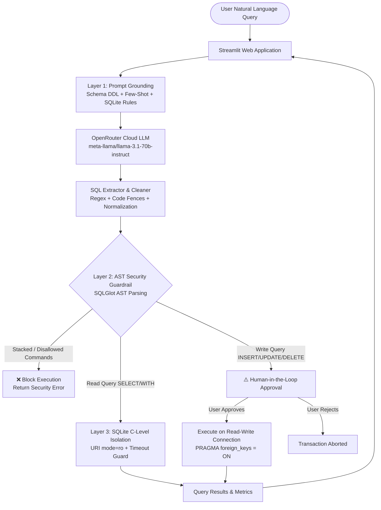

# ⚡ Text-to-SQL Generator (CRUD & Guardrails)

> **7th Semester Generative AI Capstone Project — Jury 1 Evaluation Milestone**  
> *Author: Krish Kalya ([krishkalya31012005@gmail.com](mailto:krishkalya31012005@gmail.com))*


---

## 📌 Problem Statement

Relational databases power modern business infrastructure, yet querying them requires specialized SQL knowledge. Business stakeholders, analysts, and everyday users often struggle with complex JOINs, aggregations, and dialect-specific syntax.

**Text-to-SQL Generator** bridges this gap using Generative AI. It allows users to ask questions in plain natural English and converts their intent into dialect-precise, optimized SQLite queries. To prevent unintended modifications or data corruption, the system enforces a strict **3-Layer Defense-in-Depth Security Model** with **Human-in-the-Loop approval** for any data-modifying queries (INSERT, UPDATE, DELETE, DDL).

---

## 🏗️ System Architecture & 3-Layer Defense-in-Depth

The pipeline enforces safety and dialect accuracy across three distinct boundaries:



### 🛡️ 3-Layer Security Architecture

1. **Layer 1: Prompt Grounding & Dialect Constraints**
   - Grounded with SQLite 3 DDL, column types, primary/foreign key relationships, and key business calculations.
   - Multi-tier few-shot examples (filtering, aggregations, multi-table joins, and CRUD operations).
   - Dialect rules preventing invalid function hallucination (e.g. prohibiting `DATE_TRUNC`, `STRING_AGG`, `CONCAT` and enforcing `strftime`, `GROUP_CONCAT`, `||`).
2. **Layer 2: AST Security & Lexical Guardrail (via SQLGlot)**
   - AST tokenization and tree validation using `sqlglot`.
   - Multi-statement / stacked-query rejection (prevents SQL injection chains like `SELECT 1; DROP TABLE orders;`).
   - Rejection of administrative and attachment commands (`ATTACH DATABASE`, `DETACH DATABASE`, `PRAGMA writable_schema`).
   - Deterministic classification: Read queries execute automatically; Write queries require human confirmation.
3. **Layer 3: Engine C-Level Isolation (SQLite URI `mode=ro`)**
   - Read queries execute on SQLite connections opened with percent-encoded URI `?mode=ro` and `PRAGMA query_only = ON`.
   - SQLite step-counter progress handler (`SQLiteTimeoutGuard`) preventing runaway Cartesian product stall queries.
   - Approved write transactions enforce transactional consistency and `PRAGMA foreign_keys = ON;`.

---

## 🗄️ Relational Database Schema

The project includes an E-Commerce SQLite database (`ecommerce.db`) with 4 interconnected tables seeded deterministically:

| Table | Records | Description | Primary Key | Foreign Keys |
| :--- | :---: | :--- | :--- | :--- |
| **`customers`** | 30 | Customer demographics, tiers (VIP, Regular, New, Inactive), locations | `customer_id` | — |
| **`products`** | 25 | Merchandise catalog across 5 categories, prices, costs, stock levels | `product_id` | — |
| **`orders`** | 75 | Order headers, dates, statuses (Delivered, Shipped, etc.), totals | `order_id` | `customer_id` → `customers.customer_id` |
| **`order_items`** | 180 | Line item details, quantities, unit prices, discounts (0%–20%) | `item_id` | `order_id` → `orders.order_id`<br>`product_id` → `products.product_id` |

### Key Domain Rules
- **Line Item Revenue**: `quantity * unit_price * (1 - discount)`
- **Completed Orders**: `status = 'Delivered'`
- **Profit per Item**: `products.price - products.cost`

---

## 🚀 Quick Start

### 1. Prerequisites
- **Python 3.11+** installed
- OpenRouter API key ([openrouter.ai/keys](https://openrouter.ai/keys))

### 2. Setup Virtual Environment & Dependencies

```bash
# Clone the repository
git clone https://github.com/Krish3101/text-to-sql.git
cd text-to-sql

# Create and activate virtual environment
python3 -m venv .venv
source .venv/bin/activate   # On Windows: .venv\Scripts\activate

# Install dependencies
pip install -r requirements.txt
```

### 3. Environment Configuration

Copy the sample environment file:
```bash
cp .env.example .env
```
Edit `.env` and paste your OpenRouter API key:
```env
OPENROUTER_API_KEY=sk-or-v1-your-key-here
OPENROUTER_MODEL=meta-llama/llama-3.1-70b-instruct
DB_PATH=ecommerce.db
```

### 4. Run the Application

```bash
streamlit run app.py
```
Open your browser and navigate to: **http://localhost:8501**

---

## 💡 Example Benchmark Queries (Jury Demo)

The web UI includes **Quick Demo Chips** for one-click testing:

### Tier 1: Filters & Sorting
- *"List all products in the 'Electronics' category with price under 100 sorted by price."*
- *"Show all customers from 'New York' who signed up in 2025."*
- *"Find all out-of-stock products across all categories."*

### Tier 2: Aggregations & Grouping
- *"Calculate the total revenue and number of orders for each payment method for delivered orders."*
- *"What is the average rating and total stock for each product category?"*
- *"Show the monthly total sales revenue for 2025."*

### Tier 3: Multi-Table Relational JOINs
- *"What are the top 5 customers by total spending?"* (Joins `customers` + `orders` + `order_items`)
- *"Find the top 3 best-selling products by total revenue generated."* (Joins `products` + `order_items`)
- *"Which customers have placed zero orders?"* (LEFT JOIN edge case)

### Controlled CRUD & Write Operations (Requires Approval)
- *"Add a new product called 'Wireless Earbuds' in 'Electronics' with price 89.99, cost 40.00, stock 50, rating 4.6, is_active 1."*
- *"Update the status of order 10 to 'Delivered'."*
- *"Delete customer with ID 99."*

---

## 🧪 Automated Testing

The project includes an automated test suite verifying database integrity, guardrails, SQL parsing, and engine execution.

```bash
# Run all unit tests
pytest tests/ -v

# Run code style & lint checks
ruff check .
```

All **21 tests** pass covering:
- Database seeding, schema creation, stats introspection, foreign keys, and reset.
- AST parsing, stacked query rejection, read vs write classification, disallowed command blocking.
- SQL code fence extraction, cleaning, and normalization.
- Safe read-only execution and write approval gating.

---

## 🎯 Version 1.0 Scope vs Jury 2 Roadmap

| Feature Area | Version 1.0 (Jury 1 Evaluation) | Version 2.0 Roadmap (Jury 2) |
| :--- | :--- | :--- |
| **LLM Backend** | OpenRouter Cloud LLM (`llama-3.1-70b-instruct`) | Multi-Provider + Local Ollama support |
| **Query Memory** | Single-turn prompt grounding | Multi-turn conversational context & follow-ups |
| **Security** | 3-Layer Defense-in-Depth (AST + `mode=ro`) | Role-based table/column access control (RBAC) |
| **Write Operations** | Human-in-the-loop approval confirmation | Transaction staging & visual diff review |
| **Database** | Fixed e-commerce schema with reset | Dynamic connection to external Postgres / MySQL |
| **Explainability** | Execution latency and SQL code viewer | Natural language explanation of query logic & cost |

---

## 📄 License

This project is licensed under the **MIT License** — see the [LICENSE](LICENSE) file for details.
